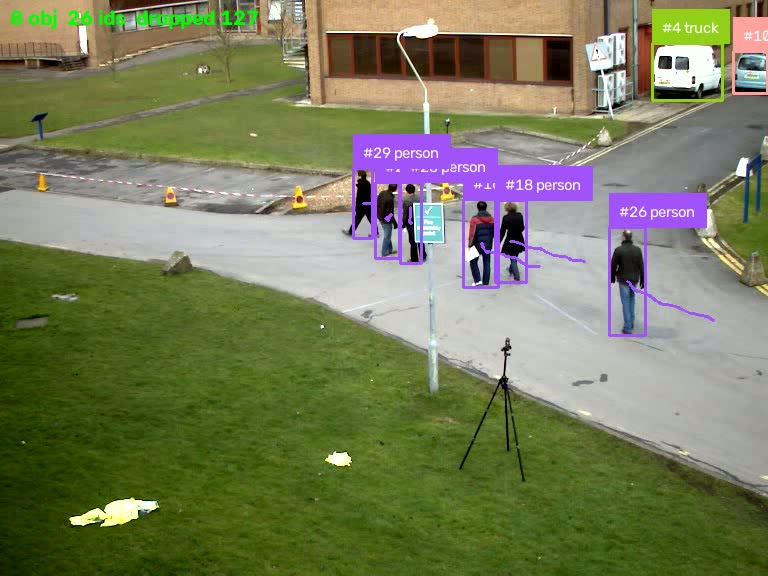

# rtsp-video-pipeline

RTSP ingestion through ffmpeg into NumPy, then custom fine-tuned YOLO model and ByteTrack
tracking on the live stream, with per-stage latency measured.

Every number below is from a run on this machine: RTX 4060 Laptop (8 GB),
Python 3.13, torch 2.13 + CUDA 12.6, ultralytics 8.4.117.



---

## The stream

I do not own an IP camera, so MediaMTX serves a file over RTSP and the pipeline
talks to that. This is normal practice for developing against RTSP and I would
say so in an interview rather than imply otherwise.

```bash
./mediamtx                                    # terminal 1
ffmpeg -re -stream_loop -1 -i data/vtest.avi \
       -c:v libx264 -preset veryfast -tune zerolatency -g 30 -r 30 \
       -f rtsp -rtsp_transport tcp rtsp://127.0.0.1:8554/cam1   # terminal 2
```

`rtsp://127.0.0.1:8554/cam1` then behaves like a network camera: H.264,
768x576, 30 fps.

---

## Pipeline latency

`yolo11n` at imgsz 640 on the live stream, 400 frames, first 15 discarded as
warm-up:

| stage | mean | p50 | p95 | max |
|---|---|---|---|---|
| inference + tracking | 17.90 ms | 18.67 | **24.87** | 33.15 |
| annotate | 1.07 ms | 1.04 | 1.43 | 2.56 |
| loop total | 18.97 ms | 19.73 | 26.11 | 34.30 |

| | |
|---|---|
| decode | 28.6 fps |
| **capacity** (1 / mean loop) | 52.7 fps |
| **sustained** (frames out / wall clock) | **16.1 fps** |
| dropped | 311 of 711 (43.7%) |
| unique track IDs | 58 |

Capacity and sustained are both reported because the gap between them is the
honest part. A frame costs 19 ms, so the loop *could* run at 52.7 fps, but end
to end only 16.1 fps came out. The decode thread and the inference loop contend
for the GIL — decoding does not release it for free, since each frame is
assembled from many partial pipe reads. Quoting 52.7 fps would be quoting the
best case as though it were the result.

### Segmentation

`--segment` swaps in the `-seg` weights and draws masks:

| | detection | segmentation |
|---|---|---|
| inference | 17.90 ms | 19.06 ms |
| annotate | 1.07 ms | **11.63 ms** |
| loop p95 | 26.11 ms | 40.87 ms |
| capacity | 52.7 fps | 32.6 fps |

Inference barely moves. Drawing the masks is 11x the cost of drawing boxes and
is what actually halves throughput — worth knowing before blaming the model.

### Dropping frames on purpose

`LatestFrame` decodes on a background thread and keeps exactly one slot. When
inference is slower than the stream, something has to give: either frames queue
and every result describes an older and older moment, or old frames are
discarded and results stay current. For live video the second is almost always
right, so the class overwrites its slot and counts what it discarded.

43.7% dropped is not a failure, it is the design working. The counter is there
so the number is visible instead of implied.

---

## Decode: hardware is not automatically faster

Measured on a 1920x1080 H.264 file rather than the RTSP stream. The publisher
paces itself with `-re`, so benchmarking against it would measure the
publisher's 30 fps and not the decoder.

| `-hwaccel` | through the pipe | ms/frame | decode only | CPU for 600 frames |
|---|---|---|---|---|
| none | **164.0 fps** | 6.10 | 1301 fps | 3.75 s |
| cuda | 104.9 fps | 9.53 | 824 fps | **0.69 s** |
| d3d11va | 155.7 fps | 6.42 | 809 fps | **0.58 s** |

**CUDA decode is 0.64x the throughput of software decode here, and uses 5.5x
less CPU.** Both facts matter and they point opposite ways.

NVDEC decodes into device memory. This pipeline wants frames in a NumPy array
on the host, so every frame is copied back across PCIe, and at 1080p that copy
costs more than the decode it replaced. On one stream, software wins.

CPU time is the number that flips it. Software decode burns 3.75 s of CPU per
600 frames against 0.69 s for NVDEC. A box serving one camera has CPU to spare;
a box serving forty does not, and there the 5.5x matters more than the 0.64x.
Which is why this is a flag and not a hardcoded choice.

### The bug this benchmark found

The first version of the reader ran at 10 fps and I assumed the decoder was
slow. It was not — `ffmpeg -benchmark` decodes this file at 1301 fps. The
bottleneck was `subprocess.Popen(..., bufsize=10**8)`:

| | throughput |
|---|---|
| `bufsize=10**8`, `read()` | 10.1 fps |
| `bufsize=-1` (default), `read()` | 157.4 fps |
| `bufsize=0`, `readinto()` | 165.9 fps |
| `bufsize=0`, `readinto()` into a fresh array | 159.9 fps |

A 100 MB buffer makes every read drag Python's `BufferedReader` through it.
16x, for one keyword argument.

The reader reads into a freshly allocated array rather than one reused buffer.
Reuse is marginally faster and hands every consumer a view that the next read
overwrites underneath them — and `LatestFrame` holds frames across reads, so
that would be a race that only shows up under load. `tests/test_pipeline.py`
asserts two consecutive frames do not share memory.

---

## Design notes

- **RTSP over TCP.** RTP over UDP drops packets under load and the artefacts
  land in the decoded frame, where a detector will happily report on them. TCP
  costs latency and retransmits instead, which is the better failure.
- **`bgr24` out of ffmpeg.** Already the byte order OpenCV expects, so a frame
  is a reshape of the pipe read with no conversion.
- **`ffprobe` for dimensions.** The guideline this was built from takes width
  and height as constructor arguments; get them wrong and every frame reshapes
  at the wrong stride, which shows up as a sheared image and not an error.
- **stderr is drained on a thread.** ffmpeg fills its stderr pipe and blocks
  otherwise, which looks exactly like a dead stream.
- **ByteTrack via ultralytics.** `supervision.ByteTrack` is deprecated and the
  separate `trackers` package would be a third dependency for an algorithm
  already inside one we import.

## MLOps

```bash
python src/track_experiment.py       # log params, metrics and artifacts to MLflow
dvc repro                            # fetch data, fetch weights, bench, profile
docker build -t rtsp-video-pipeline .
```

`dvc.yaml` has four stages: `fetch_data`, `fetch_weights`, `decode_bench`,
`profile`. The two benchmark stages declare their JSON as `metrics` with
`cache: false`, so `dvc metrics diff` shows latency moving between commits.

CI runs the tests with **numpy and pytest only** — no torch, no ultralytics.
Nothing under test needs a model, and pulling them costs minutes a run. It does
install ffmpeg, because the reader is a wrapper around ffmpeg and testing it
without one would only exercise the parts that were never the risk.

## Limitations

- **Single stream.** Multi-camera would need one process per camera, or batched
  inference. The GIL contention above is the reason for "process", not "thread".
- **No TensorRT export.** Inference is stock PyTorch. FP16 or a TensorRT engine
  is the obvious next step and is not done here.
- **The Docker image has not been run on this machine** (no Docker daemon
  available); the CI job builds it. It is a CPU image — GPU needs a CUDA base
  and an ffmpeg built with the NVIDIA decoders, noted in the Dockerfile.
- **Latency is measured, not end-to-end glass-to-glass.** It excludes camera
  exposure, encode and network time, which a real deployment has to account for.
- Tracking runs on one stream with `persist=True`; IDs are not stable across
  restarts.

## Run

```bash
python -m venv .venv && .venv/Scripts/activate    # source .venv/bin/activate on unix
pip install torch torchvision --index-url https://download.pytorch.org/whl/cu126
pip install -r requirements.txt
python src/fetch_data.py

# start MediaMTX and publish, per "The stream" above, then:
python src/pipeline.py --max-frames 400
python src/pipeline.py --segment --video-out outputs/tracked.mp4
python src/bench_decode.py --frames 600
python src/pipeline.py --hwaccel cuda            # NVDEC instead of software decode
pytest -q
```

`--device cpu` works without a GPU. Measured on this machine, inference goes
44.19 ms against 17.90 ms on the 4060 — 2.5x, less than you might expect for a
model this small. It matters anyway: capacity falls to 22.1 fps, which is below
the stream's 28.6 fps, so the pipeline stops keeping up at all and the drop rate
goes 43.7% to 68.5%.
